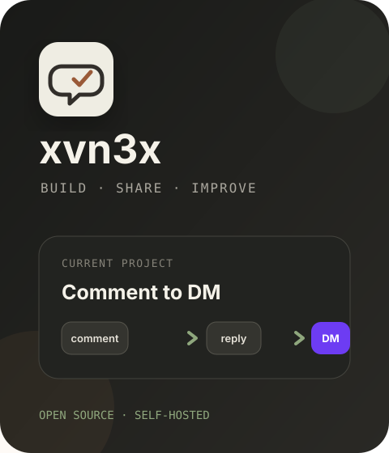

### 👋 Привет, я El — `xvn3x`

**Создаю понятные open-source продукты, которые можно развернуть у себя.**

Собираю практичные инструменты автоматизации для авторов и небольших команд.

<pre>
⚙️ Self-hosted продукты • AI agents • automation
🐧 Linux • Flipper Zero • moddable gadgets
🤖 Codex • Claude Code • custom skills • Hermes • OpenClaw
</pre>

 

### 🚀 Сейчас работаю над

#### [Comment to DM](https://github.com/xvn3x/comment-to-dm)

Self-hosted автоматизация Instagram: комментарий с ключевым словом → публичный ответ → сообщение в Direct. Работает через официальный Meta API, хранит данные на сервере владельца и распространяется бесплатно по лицензии MIT.

### 🤝 Связаться

Открыт к обратной связи, помощи с установкой Comment to DM и разработке полезных автоматизаций.

  &nbsp;
  
    
  

<!-- This repository powers the public @xvn3x profile. -->
